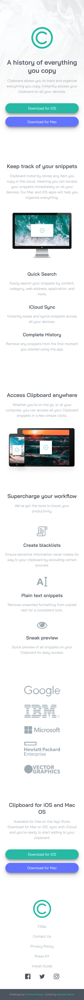

# Frontend Mentor - Clipboard landing page

Bu proje, [Frontend Mentor](https://www.frontendmentor.io/challenges/clipboard-landing-page-5cc9bccd6c4c91111378ecb9) üzerindeki **Clipboard landing page** challenge'nin çözümüdür.

## İçindekiler

- [Overview](#overview)
  - [Ekran Görüntüleri](#ekran-görüntüleri)
  - [Linkler](#links)
- [Süreç](#süreç)
  - [Kullanılan Teknolojiler & Yöntemler](#kullanılan-teknolojiler--yöntemler)
  - [Olası İyileştirmeler](#olası-i̇yileştirmeler)
- [Yazar](#yazar)

## Genel Bakış

### Ekran Görüntüleri

<table>
	<tr>
  		<td align="center"><strong>Boyut 1440px</strong></td>
  		<td align="center"><strong>Boyut 992px</strong></td>
	</tr>
  	<tr>
  	  	<td align="center" valign="top">
  	    	
  	  	</td>
		<td align="center" valign="top">
  	   		
  	  	</td>
  	</tr>
</table>

<table>
  	<tr>
  		<td align="center"><strong>Boyut 768px</strong></td>
  		<td align="center"><strong>Boyut 375px</strong></td>
	</tr>
  	<tr>
  	  	<td align="center" valign="top">
  	   		
  	  	</td>
  	  	<td align="center" valign="top">
  	    	
  	  	</td>
  	</tr>
</table>

### Linkler

- Solution URL: [Code](https://github.com/Abdullah-Bahar/Clipboard-Landing-Page)
- Canlı Önizleme: [Web Sitesini Görüntülemek İçin Tıklayınız](https://abdullah-bahar.github.io/Clipboard-Landing-Page/)

## Süreç

### Kullanılan Teknolojiler & Yöntemler
- Semantic HTML5 Yapısı
- SEO Uyumlu Heading yapısı
- CSS custom properties
- Flexbox & Nested Flexbox
- CSS Grid
- Mobile-first yaklaşımı
- Google Fonts
- Component-Based CSS
- DRY'a Uygun (Don't Repeat Your Self)

### Olası İyileştirmeler

- Görseller, `.webp` foramtına dönüştürülerek optimize edilebilir.
- CSS functions (`calc, min, clamp`) kullanılarak responsive ve flexible tasarımlar yapılabilir.

## Yazar

- GitHub - [Abdullah-Bahar](https://github.com/Abdullah-Bahar)
- Frontend Mentor - [@Abdullah-Bahar](https://www.frontendmentor.io/profile/Abdullah-Bahar)
- LinkedIn - [@bahar-abdullah](https://www.linkedin.com/in/bahar-abdullah/)
